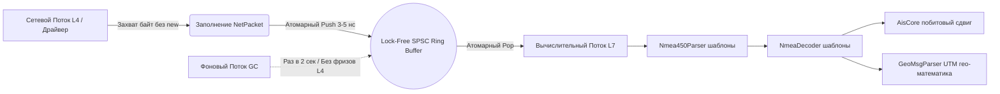

# High-Throughput Lock-Free NMEA Processor & AIS Decoder

Экстремально производительный, событийно-ориентированный C++ комплекс (C++17) для сетевого парсинга и дефрагментации навигационных пакетов NMEA, в т.ч. декодирования трафика АИС. 

Проект спроектирован по паттерну **Lock-Free Pipeline** с использованием статического полиморфизма (Compile-time инлайнинг). Комплекс гарантирует устойчивую обработку **десятков тысяч пакетов в секунду (High-Throughput, Low-Latency)** на выделенных ядрах CPU без накладных расходов времени выполнения (Zero-Runtime Overhead) и без использования блокирующих примитивов (Mutex-Free).

---

## 🚀 Архитектурные принципы High-Speed конвейера

Стандартные подходы с `std::function` (Type Erasure) и `std::mutex` (Lock Contention) на плотности трафика свыше 10 000 пак/сек вызывают аппаратные барьеры ядра ОС. Для достижения максимальной пропускной способности в данном проекте реализованы следующие Senior-решения:

1. **Разделение ядер CPU (CPU Affinity / Isolate Threads):** Сетевой поток ввода-вывода (L4) полностью изолирован от прикладного вычислительного потока (L7). Они выполняются параллельно на независимых физических ядрах процессора.
2. **Неблокирующая очередь SPSC (Single-Producer Single-Consumer):** Потоки общаются через кольцевой Lock-Free буфер на атомарных индексах. Время укладки пакета в кольцо составляет **3–5 наносекунд**, сетевой поток никогда не ждет вычислительный.
3. **Compile-time Полиморфизм (Inlining):** Из конвейера полностью удален класс `std::function` и виртуальные таблицы на внутренних слоях. Связывание слоев (`net_processor` -> `nmea450_parser` -> `nmea0183_parser` -> `ais_decoder`) осуществляется через шаблоны C++. Компилятор видит типы при сборке и производит полный инлайнинг методов, превращая иерархию слоев в монолитный блок ассемблерных инструкций CPU (устранение L1i Cache Misses).
4. **Фиксированная память (Zero Dyn-Allocation):** Все структуры сетевых пакетов (`NetworkPacket`) и локальных текстовых буферов аллоцируются статически в куче при старте приложения. Внутри сетевого цикла выполнения **вызовы `new` / `malloc` / `std::string::append` исключены полностью**.
5. **Предотвращение False Sharing (alignas 64):** Атомарные индексы чтения и записи очереди жестко разнесены по разным кэш-линиям процессора, исключая эффект ложного разделения кэша между ядрами CPU.

---

## 🛠️ Схема конвейера данных (Lock-Free Threading)



---

## 📂 Структура и состав файлов проекта

Для успешной сборки и валидации проекта в репозитории должны присутствовать следующие файлы:

- **`CMakeLists.txt`** — Скрипт кроссплатформенной сборки. Содержит флаги агрессивной векторизации и флаг оптимизации математики `-ffast-math` (`/fp:fast`).
- **`main.cpp`** — Точка входа и главный оркестратор. Содержит параллельные циклы потоков ввода-вывода и вычислительного конвейера, а также тестовые наборы данных.
- **`lock_free_queue.h`** — Шаблонный класс кольцевой SPSC Lock-Free очереди на атомарных индексах с выравниванием `alignas(64)`.
- **`compile_time_pipeline.h`** — Шаблонные интерфейсы классов `NmeaDecoder` и `Nmea450Parser` для статического сквозного связывания слоев.
- **`net_processor.h` / `net_processor.cpp`** — Базовое сетевое ядро транспортного уровня L4. Управляет пулом TCP/UDP сессий.
- **`garbage_collection_service.h` / `garbage_collection_service.cpp`** — Управляющий сервис-расширение. Запускает и безопасно останавливает фоновый поток очистки таймаутов (Garbage Collector).
- **`nmea450_parser.h` / `nmea450_parser.cpp`** — Сетевой парсер L5 (IEC 61162-450). Отвечает за разбор TAG-блоков и Sentence Grouping (теги `g:`).
- **`nmea0183_parser.h` / `nmea0183_parser.cpp`** — Базовый текстовый парсер L7. Отвечает за валидацию XOR-чексуммы, токенизацию полей и маршрутизацию пакетов.
- **`geo_msg_parser.h` / `geo_msg_parser.cpp`** — Высокоскоростное ядро прикладной математики. Агрегирует разбор 32 типов сообщений (включая *Fugro, Trimble, Leica, Furuno*) и обратную проекцию Гаусса-Крюгера/UTM.
- **`ais_decoder.h` / `ais_decoder.cpp`** — Модуль бинарного декодирования ITU-R M.1371 (сообщения 1-5, 18, 19, 27). Осуществляет побитовый разбор 6-bit ASCII потоков.
- **`ais_structures.h`** — Заголовочный файл структур данных результатов бинарного разбора АИС (`AisPosReport`, `AisDataReport`).
- **`nmea_structures.h`** — Заголовочный файл финальной унифицированной структуры `NmeaReport`.
- **`Talker_IDs.txt` / `Message_Types.txt` / `Talker_prop_codes.txt`** — Внешние текстовые файлы справочников и словарей (формат `КОД=Описание`).

---

## 📊 Спецификация выходных данных модуля

Результатом работы конвейера является вызов единого распределительного колбэка `SetOnReport`, который возвращает верхнему уровню бизнес-логики (или СУБД) плоскую структуру **`NmeaPositionReport`**, состоящую из следующих **14 параметров**:

1. **`raw_sentence`** (`std::string`) — **Сообщение NMEA**. Полная исходная сырая строка, очищенная от бинарных сетевых заголовков `UdPbC`.
2. **`five_letter_head`** (`std::string`) — **5-буквенный заголовок с 1-м символом**. Заголовочная часть пакета (например, `"$GPRMC"`, `"$PASHR"`, `"!AIVDM"`).
3. **`device_description`** (`std::string`) — **Talker ID или код производителя (текстовое описание)**. Расшифрованное описание источника, прочитанное по двухбуквенному коду из файла `Talker_IDs.txt` (например, *"Global Positioning System"*).
4. **`manufacturer_desc`** (`std::string`) — **Код проприетарного производителя (текстовое описание)**. Если строка является вендорской (`$P...`), сюда подставляется текстовое описание бренда из файла `Talker_prop_codes.txt` (например, *"Garmin International"*, *"Trimble Navigation"*). Для стандартных строк возвращает *"N/A"*.
5. **`message_type_desc`** (`std::string`) — **Тип сообщения (текстовое описание)**. Расшифрованное описание функционала строки из файла `Message_Types.txt` (например, *"Global Positioning System Fix Data"*).
6. **`message_source`** (`std::string`) — **Источник сообщения**. Сетевой или физический канал, с которого был захвачен пакет (например, `UDP_4001`, `TCP_5002` или имя прибора из TAG-блока).
7. **`timestamp`** (`std::string`) — **Timestamp сообщения**. Временной штамп фиксации пакета (извлекается из UNIX-времени тега `c:` NMEA-450 или полей времени UTC самого сообщения).
8. **`object_id`** (`std::string`) — **Идентификатор объекта**. MMSI номер для целей АИС, имя/номер трека цели для радарных строк (`TMM`/`TLL`), либо маркер *"Internal GNSS"* для собственного судна.
9. **`latitude`** (`double`) — **Широта**. Географическая широта в десятичных градусах (WGS-84), нормализованная с учетом знака полушария. При поступлении плоских метров из проприетарных строк (*Fugro/Trimble*), они автоматически пересчитываются сюда обратным геодезическим движком.
10. **`longitude`** (`double`) — **Долгота**. Географическая долгота в десятичных градусах (WGS-84).
11. **`speed_knots`** (`double`) — **Скорость объекта**. Скорость относительно грунта (SOG), унифицированная для всех типов датчиков и приведенная к единому стандарту — **в узлах**.
12. **`heading_degrees`** (`double`) — **Направление движения**. Путевой угол относительно грунта (COG) или истинный курс, приведенный строго **в градусы**.
13. **`ais_msg_type`** (`uint32_t`) — **Тип сообщения AIS**. Числовой код сообщения (1-5, 18, 19, 27) согласно спецификации ITU-R M.1371. Для не-AIS строк равен `0`.
14. **`ais_raw_payload`** (`std::string`) — **Исходное сообщение AIS**. Чистый инкапсулированный 6-битный ASCII текстовый блок, извлеченный из 5-го поля NMEA-предложения (заполняется только при `is_ais = true`).

*Примечание: При разборе статических рейсовых данных (AIS тип 5) структура дополнительно дописывает параметры текстового рейса: `ais_vessel_name` (Название судна), `ais_call_sign` (Позывной) и `ais_destination` (Пункт назначения).*

---

## ⚙️ Требования к окружению

- **Язык:** C++17 или новее.
- **Компилятор:** MSVC (Visual Studio 2019+), GCC (g++ 9+), или Clang 10+.
- **ОС:** Кроссплатформенно (Windows / Linux).

---

## 🏗️ Инструкция по сборке через CMake

Для полной оптимизации Compile-time полиморфизма и автоматической векторизации математических рядов Тейлора, проект необходимо компилировать строго в конфигурации **Release** с флагами агрессивной математической оптимизации:

```cmake
cmake --preset mingw
cmake --build --preset mingw-release --clean-first
```

В соответствии с заложенными флагами `CMakeLists.txt`, на Windows включится режим `/fp:fast` и инструкции `AVX2`, а на Linux — флаги `-O3`, `-ffast-math` и векторизация `-ftree-vectorize`, что развернет тригонометрический контур в параллельные регистры процессора.
Для MSVC используйте отдельный build tree:

```powershell
cmake --preset msvc
cmake --build --preset msvc-release --clean-first
```

Результаты сборки раскладываются автоматически:

- исполняемые файлы: `build/<toolchain>/release` (`RUNTIME_OUTPUT_DIRECTORY`);
- динамические библиотеки: `build/<toolchain>/lib` (`LIBRARY_OUTPUT_DIRECTORY`);
- импортные и статические библиотеки: `build/<toolchain>/archive` (`ARCHIVE_OUTPUT_DIRECTORY`).

MSVC-специфичные инструкции находятся в `msvc/`. Пример DHF находится в `DHF/_example/`, код DLL-модуля находится в корне проекта.
